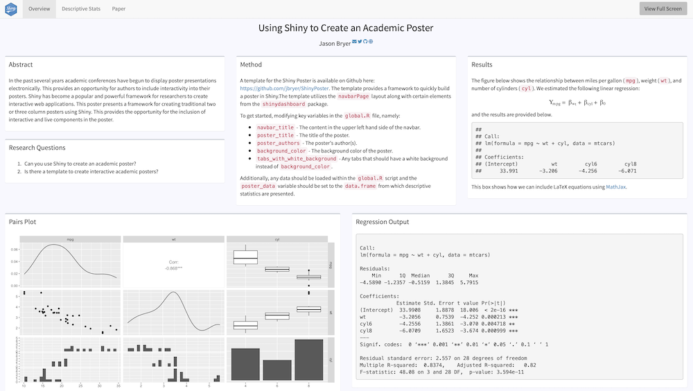

## Using Shiny to Create an Academic Poster

Author: [Jason Bryer, Ph.D.](mailto:jason@bryer.org)


To view the example poster, run the following command in R:

```
shiny::runGitHub('jbryer/ShinyPoster')
```

The example poster gives directions on building your own Shiny poster.

You can view a poster created for AERA 2022 titled *Efficacy of the Diagnostic Assessment and Achievement of College Skills for Traditional-Age College Students* here: https://r.bryer.org/shiny/AERA2022/


